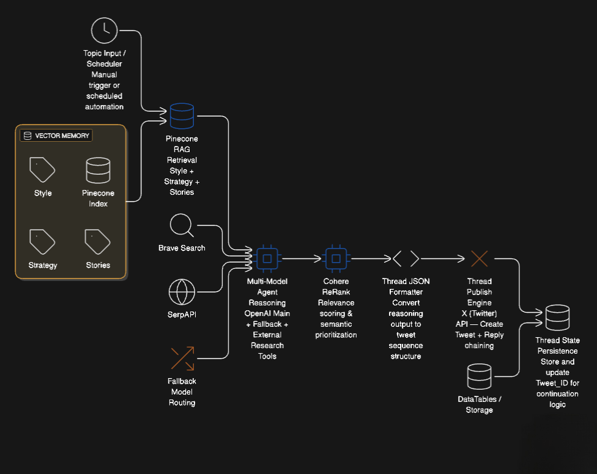
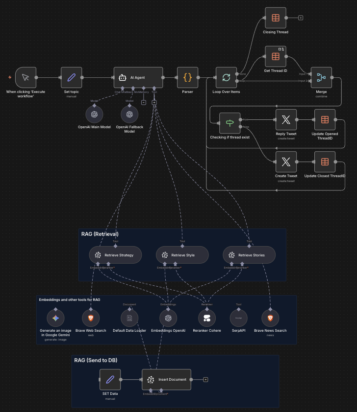
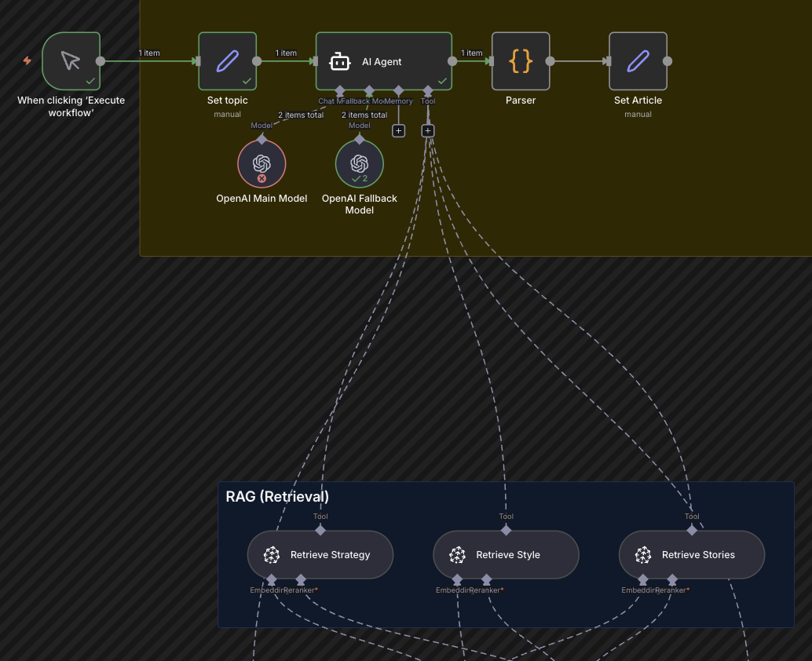
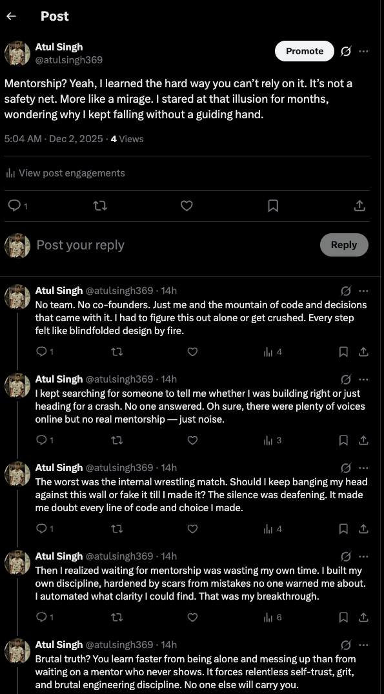

# AI X Auto Posting Agent — RAG-Powered Thread Generation & Auto-Publish Workflow

Autonomous workflow that transforms topic input into fully generated multi-tweet threads using RAG contextual memory, external research tools, and automatic publishing to X (Twitter). Includes thread continuation tracking, identity-based writing style, and real-time posting logic.


---

Autonomous X thread generation and publishing system powered by Retrieval-Augmented Generation (RAG), multi-tool reasoning, cinematic AI image generation, and automated posting through X API.  
Built using n8n, Pinecone vector search, OpenAI LLMs, Brave/Serp search tools, Google Gemini image generation, and X publishing API.

Designed for founders, creators, and growth teams to automate personal branding and top-of-funnel distribution.

---

## 🚀 Overview

This workflow automatically:
• Generates a storytelling-style X thread (Twitter) using RAG context
• Pulls semantic memory from Pinecone across style, strategy & personal story namespaces
• Uses multi-model reasoning with OpenAI + fallback routing
• Calls research tools (Brave, SerpAPI) for real-world references
• Publishes the full thread automatically with reply chaining
• Maintains thread state across runs using thread IDs
• Handles auto-continue + closure logic

This system turns creative ideation → publishing pipeline into a completely automated execution loop.

---

## 🔑 Key Capabilities

• RAG-powered multi-namespace semantic memory (style, strategy, stories)  
• OpenAI embedding + Pinecone vector search for contextual grounding  
• Automated ranking and retrieval reranking using Cohere ReRank  
• External real-time research via SerpAPI and Brave search  
• Auto-publishing to X feed  
• Alternate model routing for resilience  

---

## 🧠 Architecture



---

Core Components:
• Pinecone (vector DB, multi-namespace memory store)  
• n8n (workflow orchestration & agent framework)  
• OpenAI GPT-4.1-mini & embeddings  
• SerpAPI + Brave web & news search  
• X Posting API

---

## 🛠 Tech Stack

| Component         | Technology                   |
| ------------------| ---------------------------- |
| Workflow Engine   | n8n                          |
| LLM               | OpenAI GPT-4.1-mini          |
| Embeddings        | text-embedding-3-large       |
| Images            | Gemini 2.5 Flash Image       |
| Vector DB         | Pinecone                     |
| Reranker          | Cohere ReRank                |
| Search Tools      | Brave, SerpAPI               |
| Publishing        | X / Twitter OAuth2 API       |
| Parsing & Glue    | JS Code execution inside n8n |
| Data Persistence  | DataTables / Thread IDs    |

---

## 📊 Results & Impact

• Replaces manual writing + posting effort
• Automates daily thread creation with real narrative depth
• Consistency without burnout
• Raw emotional storytelling → higher engagement vs generic AI posts

---

## 📂 Repo Structure

```
ai-x-auto-thread-agent/
│── export.json
│── featured-assets/
│   └── architecture.png
│   └── screenshot0.png
│   └── screenshot1.png
│   └── screenshot2.png
│   └── screenshot3.png
│── README.md
│── LICENSE
```

---

## 📸 Workflow Preview (Live System Screenshot)

| | |
|---|---|
|  |  |
|  |  |


---

## 🧪 Future Enhancements

• Video and carousel support for X
• Multi-platform cross-posting (LinkedIn + Threads + Reddit)
• Engagement scoring feedback loop
• Auto-respond via AI commenting agent

---

## 🤝 Contributing

Open to feature requests, prompts, and automation ideas.
DM or open an issue if you're building something similar.

---

## 📬 Contact

**Built by:** Atul Singh — AI Automation Architect  
📧 Email: atulsingh.0369@gmail.com  
🔗 LinkedIn: https://linkedin.com/in/atulsingh369  
🔗 [Visit my Portfolio](https://atulsingh369.netlify.app)

---

## 📄 License

This project is licensed under the Apache License 2.0. See [LICENSE](https://github.com/atulsingh369/ai-x-auto-thread-agent?tab=Apache-2.0-1-ov-file) for details.

---

⭐ This project is featured as a top pinned repo to demonstrate real applied AI automation with RAG and autonomous agent orchestration.